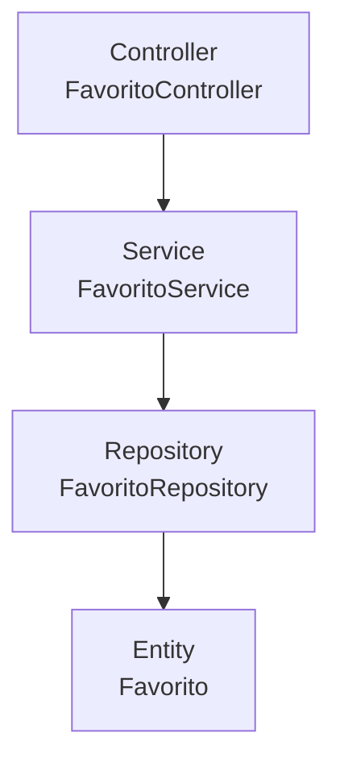

# Semana 6 · Arquitectura en capas de una API

**Asignatura:** Desarrollo Fullstack — Unidad 2 (Backend, API REST y persistencia)
**Caso elegido:** API de favoritos para una Pokédex (guardar y consultar los Pokémon favoritos de un usuario)

## 1. Diagrama de capas



## 2. Responsabilidad de cada capa

| Capa | Responsabilidad |
|---|---|
| **Controller** (`FavoritoController`) | Expone las rutas HTTP (`GET`, `POST`, etc.), recibe la petición del cliente, valida el formato básico de la entrada y traduce la petición en una llamada al service. No contiene lógica de negocio ni toca la base de datos directamente. |
| **Service** (`FavoritoService`) | Contiene la lógica de negocio: verificar que el Pokémon no esté ya en la lista de favoritos del usuario, aplicar reglas como un límite máximo de favoritos, formatear la respuesta. Orquesta las llamadas al repository. |
| **Repository** (`FavoritoRepository`) | Es la única capa que habla con la base de datos. Ejecuta las consultas (crear, leer, actualizar, eliminar) y devuelve entidades, sin saber nada de HTTP ni de reglas de negocio. |
| **Entity** (`Favorito`) | Representa el modelo de datos tal como se guarda en la base de datos (`id`, `id_usuario`, `id_pokemon`, `apodo`, `fecha`). Es una estructura de datos, sin lógica. |

## 3. Endpoint de ejemplo

`POST /api/favoritos`

```json
{
  "pokemonId": 25,
  "apodo": "Pikachu"
}
```

**Recorrido por las capas:**

1. El **controller** recibe la petición, valida que `pokemonId` venga presente y llama a `favoritoService.agregar(usuarioId, pokemonId, apodo)`.
2. El **service** verifica que ese Pokémon no esté ya guardado por el usuario (regla de negocio) y, si todo está bien, construye una `Favorito` (entity) y llama a `favoritoRepository.guardar(favorito)`.
3. El **repository** ejecuta el `INSERT` en la base de datos usando la **entity** recibida.
4. La respuesta sube de vuelta: repository → service → controller, que finalmente devuelve el JSON con código `201 Created` al cliente.

---

**CONFIG**
- FULL_NAME: Santi
- GITHUB_USER: <completa tu usuario de GitHub>
